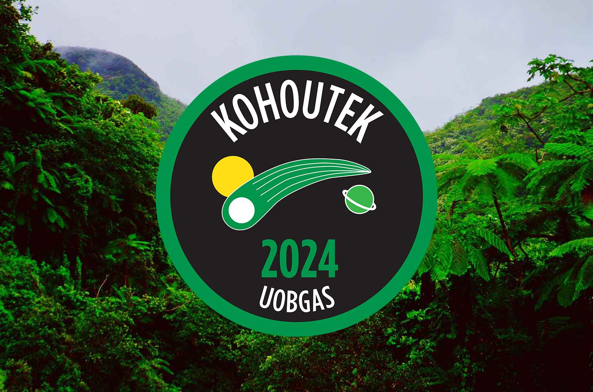

# Kohoutek
Kohoutek is a competition and activity day run for Scouts and Guides, organised by students from the [University of Bristol Guides and Scouts (UOBGAS)](https://www.facebook.com/UoBGaS) society, part of the [Student Scout and Guide Organisation (SSAGO)](https://ssago.org).

This repository contains the source for the event portal, built using the [Flask](https://github.com/pallets/flask/) micro web framework and [UIKit](https://github.com/uikit/uikit) front-end framework, which groups use to sign up for the event and manage their booking. It also includes a static 'splash page' which was used in the run up to the event, scripts for creating and managing the database, and Docker compose files to run all of this.
