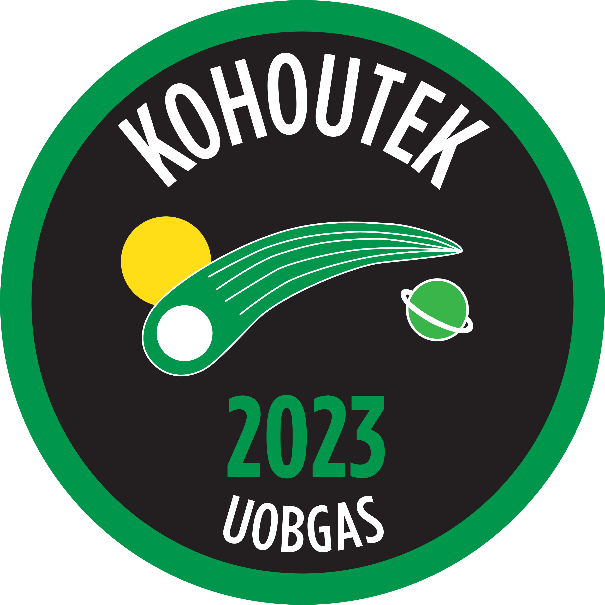
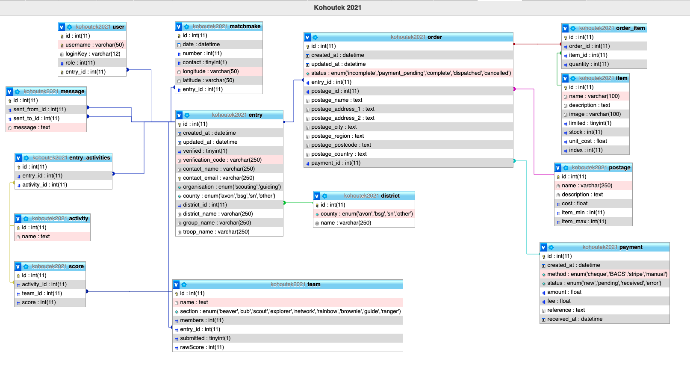

# Kohoutek Competition
Kohoutek is a competition and activity day run for Scouts and Guides, organised by students at the University of Bristol, with support from the [University of Bristol Guides and Scouts (UOBGAS)](https://www.facebook.com/UoBGaS) society, part of the [Student Scout and Guide Organisation (SSAGO)](https://ssago.org).

In 2021 the competition was organised online in response to the global COVID-19 pandemic, which prevented Guides and Scouts from coming together to compete. Teams chose four 'Under The Sea' themed activities to complete during March 2021 from a pack put together by UOBGAS members and submitted their scores through the online portal.

While the normal in-person competition is only open to Scouts & Guides from around the South West of England (Scouts in 'Avon' Scout County, and Guides in 'Bristol and South Gloucestershire' and 'Somerset North' Guide Counties) this online edition was opened up to all groups, and even gained some international entries from Portugal and Canada.

In total 156 teams took part from 54 different groups, with 716 total participants. 85 of these teams were from the South West and so were also competing for the Kohoutek Trophy, as well for as the kudos of winning Kohoutek 2021.  s

The overall winning team was **Luís Vaz de Camões** from **1240 Murtal** (Lisbon, Portugal), with 186 points out of 200. The winners of the Kohoutek Trophy were **OSR Team One** from **1st Stoke Gifford Scout Group**, with 185 points.

## This Repository
This repository contains the complete source for the online event, including an online portal built using the [Flask](https://github.com/pallets/flask/) micro web framework and [UIKit](https://github.com/uikit/uikit) front-end framework, which groups used to sign up, access the activities, order badges, and enter their teams' scores.

It also includes a static 'splash page' which was used in the run up to the event, a set of scripts for creating and managing the database, and the Apache configuration file.

## Database
The current build of the app uses SQLite for development, and MySQL for the production version.

